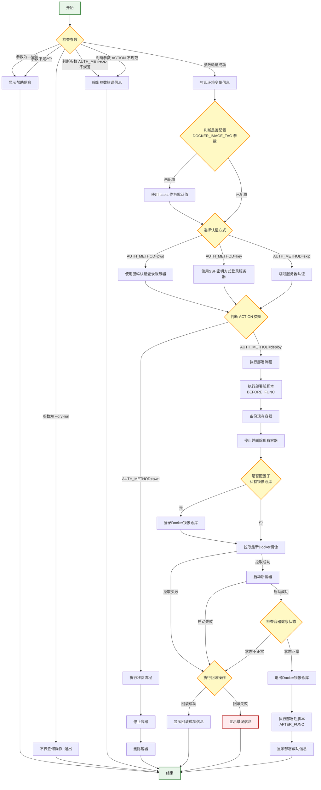

# CD deployments 整体流程图

```mermaid
graph TD
%%  参数验证流程
    Start[开始] --> CheckParams{检查参数}
    CheckParams -->|参数为 --help| ShowHelp[显示帮助信息]
    CheckParams -->|参数不足2个| ShowHelp
    CheckParams -->|参数为 --dry-run| DryRun[不做任何操作, 退出]

    CheckParams -->|判断参数 AUTH_METHOD 不规范| ParamsErr[输出参数错误信息]
    CheckParams -->|判断参数 ACTION 不规范| ParamsErr

    CheckParams -->|参数验证成功| PrintEnv[打印环境变量信息]
    PrintEnv --> IsDockerImageTag{判断是否配置<br/>DOCKER_IMAGE_TAG 参数}

    IsDockerImageTag -->|未配置| IsDockerImageTagNo[使用 latest 作为默认值]
    IsDockerImageTag -->|已配置| SelectAuthMethod{选择认证方式}
    IsDockerImageTagNo --> SelectAuthMethod

%%  服务器登陆认证流程
    SelectAuthMethod -->|AUTH_METHOD=pwd| AuthWithPassword[使用密码认证登录服务器]
    SelectAuthMethod -->|AUTH_METHOD=key| AuthWithKey[使用SSH密钥方式登录服务器]
    SelectAuthMethod -->|AUTH_METHOD=skip| SkipServerAuth[跳过服务器认证]

    AuthWithPassword --> SelectAction{判断 ACTION 类型}
    AuthWithKey --> SelectAction
    SkipServerAuth --> SelectAction
    SelectAction --> |AUTH_METHOD=pwd| Stop[执行移除流程]

%%  服务卸载流程
    Stop --> DockerStop[停止容器]
    DockerStop --> DockerDelete[删除容器]

%%  服务部署流程
    SelectAction --> |AUTH_METHOD=deploy| Deploy[执行部署流程]
    Deploy --> RunBeforeFunc[执行部署前脚本<br/>BEFORE_FUNC]
    RunBeforeFunc --> BackupContainers[备份现有容器]
    BackupContainers --> StopDeleteOldContainers[停止并删除现有容器]
    StopDeleteOldContainers --> CheckPrivateRegistry{是否配置了<br/>私有镜像仓库}
    CheckPrivateRegistry -->|是| LoginDockerRegistry[登录Docker镜像仓库]
    CheckPrivateRegistry -->|否| PullLatestImage[拉取最新Docker镜像]
    LoginDockerRegistry --> PullLatestImage
    PullLatestImage -->|拉取失败| Rollback{执行回滚操作}
    PullLatestImage -->|拉取成功| StartNewContainer[启动新容器]
    StartNewContainer -->|启动失败| Rollback
    StartNewContainer -->|启动成功| CheckHealthStatus{检查容器健康状态}
    CheckHealthStatus -->|状态不正常| Rollback
    CheckHealthStatus -->|状态正常| LogoutDockerRegistry[退出Docker镜像仓库]
    LogoutDockerRegistry --> RunAfterFunc[执行部署后脚本<br/>AFTER_FUNC]
    RunAfterFunc --> ShowDeploySuccess[显示部署成功信息]
    
    
    Rollback -->|回滚成功| ShowRollbackSuccess[显示回滚成功信息]
    Rollback -->|回滚失败| ShowErrorInfo[显示错误信息]


    ShowHelp --> End[结束]
    DryRun --> End
    ParamsErr --> End
    ShowDeploySuccess --> End
    DockerDelete --> End
    ShowRollbackSuccess --> End
    ShowErrorInfo --> End


    classDef process fill:#e1f5fe,stroke:#01579b,stroke-width:2px;
    classDef decision fill:#fff9c4,stroke:#ff8f00,stroke-width:2px;
    classDef startend fill:#e8f5e9,stroke:#2e7d32,stroke-width:2px;
    classDef error fill:#ffebee,stroke:#b71c1c,stroke-width:2px;


    class Start,End startend;
    class ErrorExit,ShowErrorInfo error;
    class CheckParams,IsDockerImageTag,SelectAuthMethod,SelectAction,CheckPrivateRegistry,CheckHealthStatus,CheckHealthStatus,Rollback decision;
```