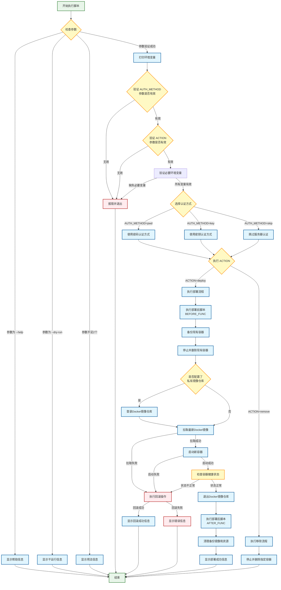

```mermaid
graph TD
    Start[开始执行脚本] --> CheckParameters{检查参数}
    CheckParameters -->|参数为 --help| ShowHelp[显示帮助信息]
    ShowHelp --> End[结束]
    CheckParameters -->|参数为 --dry-run| DryRun[显示干运行信息]
    DryRun --> End
    CheckParameters -->|参数不足2个| ShowUsage[显示用法信息]
    ShowUsage --> End
    CheckParameters -->|参数验证成功| PrintEnvVars[打印环境变量]
    
    PrintEnvVars --> ValidateAuthMethod{验证 AUTH_METHOD<br/>参数是否有效}
    ValidateAuthMethod -->|无效| ErrorExit[报错并退出]
    ErrorExit --> End
    ValidateAuthMethod -->|有效| ValidateAction{验证 ACTION<br/>参数是否有效}
    ValidateAction -->|无效| ErrorExit
    ValidateAction -->|有效| ValidateEnvVars[验证必要环境变量]
    
    ValidateEnvVars -->|缺失必要变量| ErrorExit
    ValidateEnvVars -->|所有变量有效| SelectAuthMethod{选择认证方式}
    
    SelectAuthMethod -->|AUTH_METHOD=pwd| AuthWithPassword[使用密码认证方式]
    SelectAuthMethod -->|AUTH_METHOD=key| AuthWithKey[使用密钥认证方式]
    SelectAuthMethod -->|AUTH_METHOD=skip| SkipServerAuth[跳过服务器认证]
    
    AuthWithPassword --> ExecuteAction{执行 ACTION}
    AuthWithKey --> ExecuteAction
    SkipServerAuth --> ExecuteAction
    
    ExecuteAction -->|ACTION=deploy| DeployProcess[执行部署流程]
    ExecuteAction -->|ACTION=remove| RemoveProcess[执行移除流程]
    
    DeployProcess --> RunBeforeFunc[执行部署前脚本<br/>BEFORE_FUNC]
    RunBeforeFunc --> BackupContainers[备份现有容器]
    BackupContainers --> StopDeleteOldContainers[停止并删除现有容器]
    StopDeleteOldContainers --> CheckPrivateRegistry{是否配置了<br/>私有镜像仓库}
    CheckPrivateRegistry -->|是| LoginDockerRegistry[登录Docker镜像仓库]
    CheckPrivateRegistry -->|否| PullLatestImage[拉取最新Docker镜像]
    LoginDockerRegistry --> PullLatestImage
    PullLatestImage -->|拉取失败| Rollback[执行回滚操作]
    PullLatestImage -->|拉取成功| StartNewContainer[启动新容器]
    StartNewContainer -->|启动失败| Rollback
    StartNewContainer -->|启动成功| CheckHealthStatus[检查容器健康状态]
    CheckHealthStatus -->|状态不正常| Rollback
    CheckHealthStatus -->|状态正常| LogoutDockerRegistry[退出Docker镜像仓库]
    LogoutDockerRegistry --> RunAfterFunc[执行部署后脚本<br/>AFTER_FUNC]
    RunAfterFunc --> CleanupResources[清理备份镜像和资源]
    CleanupResources --> ShowDeploySuccess[显示部署成功信息]
    
    Rollback -->|回滚成功| ShowRollbackSuccess[显示回滚成功信息]
    Rollback -->|回滚失败| ShowErrorInfo[显示错误信息]
    
    RemoveProcess --> StopDeleteContainers[停止并删除指定容器]
    
    ShowDeploySuccess --> End
    ShowRollbackSuccess --> End
    ShowErrorInfo --> End
    StopDeleteContainers --> End
    
    classDef process fill:#e1f5fe,stroke:#01579b,stroke-width:2px;
    classDef decision fill:#fff9c4,stroke:#ff8f00,stroke-width:2px;
    classDef startend fill:#e8f5e9,stroke:#2e7d32,stroke-width:2px;
    classDef error fill:#ffebee,stroke:#b71c1c,stroke-width:2px;
    
    class Start,End startend;
    class CheckParameters,ValidateAuthMethod,ValidateAction,SelectAuthMethod,ExecuteAction,CheckPrivateRegistry,CheckHealthStatus decision;
    class ShowHelp,DryRun,ShowUsage,PrintEnvVars,ErrorExit,AuthWithPassword,AuthWithKey,SkipServerAuth,DeployProcess,RemoveProcess,RunBeforeFunc,BackupContainers,StopDeleteOldContainers,LoginDockerRegistry,PullLatestImage,StartNewContainer,LogoutDockerRegistry,RunAfterFunc,CleanupResources,ShowDeploySuccess,Rollback,ShowRollbackSuccess,ShowErrorInfo,StopDeleteContainers process;
    class ErrorExit,Rollback,ShowErrorInfo error;
```